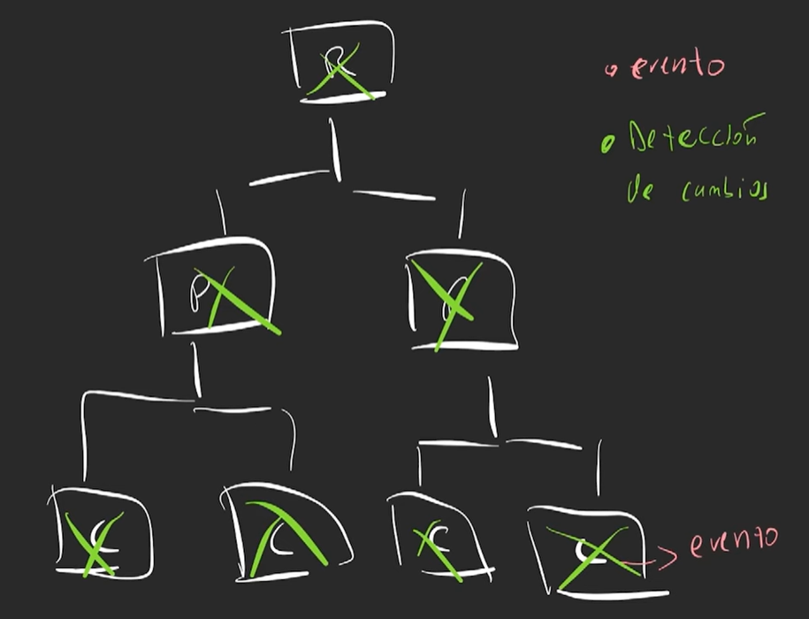
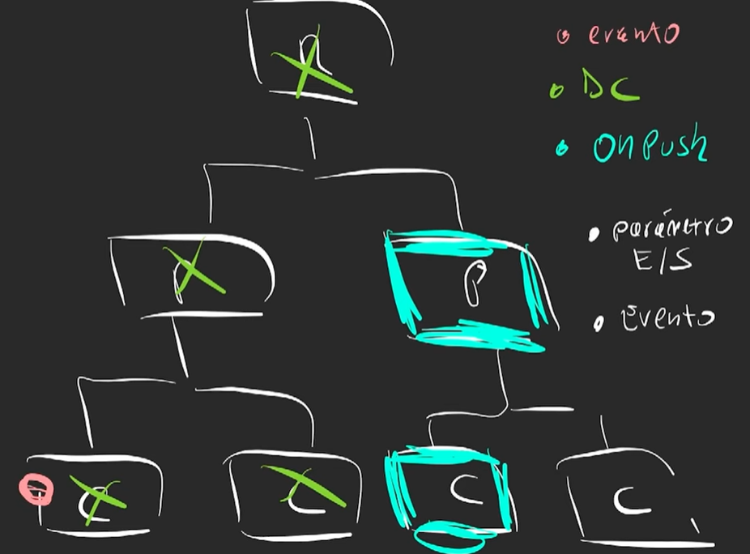

# Cosas por tener encuenta

- Tener el CLI de angular Con respecto a la versiaon de angular mas reciente

## Utilizar Yarn

Para compilar todos los campos de node modules todas la librerias  las ejecuten sin neceidad de node modules y sea escalable y corto de usar
Eliminar ``package-lock.json``
y ejecutar:

```bash
  yarn
```

mostrando lo siguiente:

## Sugerencia

``angular.json``  

confugurar la parte de:

| Initial chunk files | Name     | Raw Size |
|-----------------------|----------|----------|
| polyfills.js          | polyfills| 90.20 kB |
| main.js               | main     | 22.83 kB |
| styles.css            | styles   | 96 bytes |
| **Initial Total**     |          | **113.12 kB** |

Application bundle generation complete.[0.116 seconds]

Esto es el tiempo de ejecucion

Poner asi

```json
"builder": "@angular-devkit/build-angular:browser-esbuild",
```

Quitar de esta asi:

```json
"builder": "@angular-devkit/build-angular:browser",
```

## editorconfing

Es lo que se utiliza para formatear el codigo siguiendo esas reglas

## styles.scss

Estilos globales de toda la aplicacion afecta todos los componentes

## main.ts

donde hacemos el bootstrapApplication angular se ejecuta y el componente inicial de todos

## Index.html

la pagina total porque sigue siendo un single page aplication

## Angular 17

### Deteccion  de cambios

**Zone.js** es una logica que se encarga de la deteccion de cambios
state

Angular dice 3 cosas que pueden ocacionar un render:

- cualquier operacion **async** puede hacer un cambio
- cualquier operacion que venga en el **Network** que puede ser un request
- Cualquier **Evento** que puede ser ``click``,``Keydonw``

Puede ser un:

- SetTimeOut
- SetInterval

Se puede usar una dependencia para que no tome el manejador de zona

### Computos lentos

- Evaluar expresiones que hayan en el templete

```js Cambio
  interface DoCheck {
    ngDoCheck(): void
  }
```

Cambio despues

```js Cambio
 interface AfterContentChecked {
    ngAfterContentChecked(): void
  } 
```

```js Cambio
 interface AfterContentChecked {
    ngAfterContentChecked(): void
  } 
```

### Soluciones

1. Solucionar y agilizar el algoritmo
2. Utilizar ``Caching``- pure [Pipe](https://v17.angular.io/guide/pipes-overview)
3. memorization +1 resultado
4. Tratar de que no hayan renders


Forma de usarlas informacion sobre casteo de datos para mostralo
[Pipes](https://v17.angular.io/guide/pipes-overview)

``` js
  {{ value_expression | date [ : format [ : timezone [ : locale ] ] ] }}
```

En angular cuando occure un cambio en un componentes busca en todos los componentes roots y padres pasa saber el cambio

Ejemplo:


Ejemplo:

Este cambio se ejecuta cuando se da el cambio en solo ese elemnto utilizando [onPush](https://angular.dev/best-practices/skipping-subtrees#using-onpush)



#### onPush

- enventos
- parametros
utilizando chanegDetectorRet

```js
changeDetection:ChangeDetectionStrategy.OnPush,
```

Se coloca esto en el componentec para que tenga la propiedad de accede con la propiedad onpush para no renderizar todo

### conseptos

```js
  [(text)]
```

### Se puede compartir el estaodo

root es el unico que se ven afectados

## Singnals

Esta implementado Zone.js

Angulas 17  va ser 100%  signals

78 % que van en una empresa no estan actualizados

